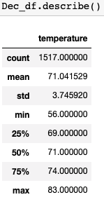
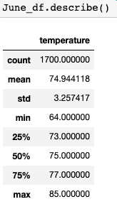
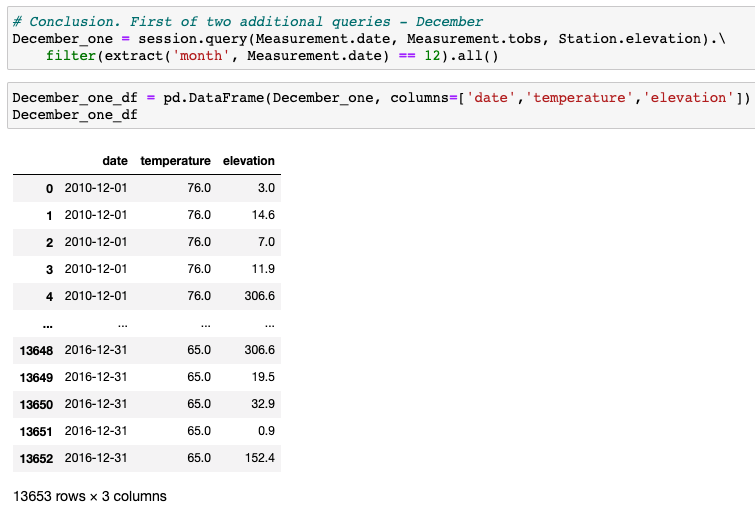
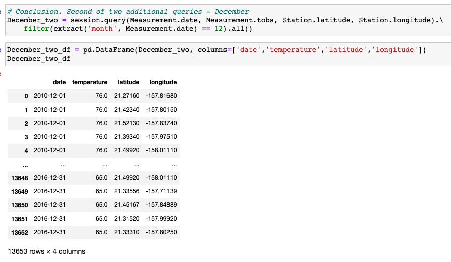

# surfs_up
"Waves and Ice-cream" Weather Analysis: Jupyter Notebook, SQLite, VS Code, and GitHub

## Overview:

The purpose of this analysis was to determine that the weather conditions in Hawaii are favorable to investing in the Surf and Shake business out of fear of the weather altering sales. Initially, we analyzed the recorded precipitation to ensure that it was favorable. In this instance, we will be analyzing the temperature records to ensure that they will be consistently favorable as well. 

## Results: 

There were three key observations made regarding the differences between the temperatures in the months of June and December:

1. First key difference between the months of June and December is that the minimum temperature is 8 degrees lower in December than in June with a temperaure of 56 degrees and compared to June's 64 degrees farenheit

2. Second key differences between the months of June and December is that there are significantly 200 more data points in June than in December, wheere these missing data points could have a significant impact on outcome, but it is currently unknown

3. Third key differences between the months of June and December is that there is literally a 2-4 degree difference between June and decembers mean, 25%, 50%, 75%, and maximum temperatures. with June being the higher temperature. 

      

## Conclusion
In conclusion, the analysis performed in this report focuses on temperatures of the island and how well these temperatures can remain favorable to potential customers around. Based on the information obtained, those temperatures are steadily on average between 71 degrees during its coldest month, and 75 degrees on its hottest month. Fluctuations between these months, both on average and 75% of the time only fluctuated by 3 degrees of 74 - 77 degrees between the two months. Overall, these temperature points are usually what people consider favorable and steady weather year round, pointing to an environment for a very successful business.

If we wanted to dig a little deeper, two other queries that could be performed are of the temperature and precipitation against the elevation and also against the latitude and longitude, in effort to see if there is a change in the measurements as a result. 

Examples shown below are based off of December's data:

